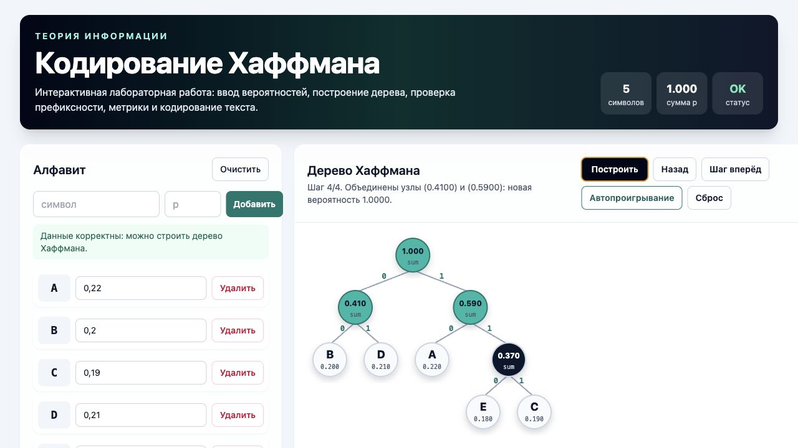
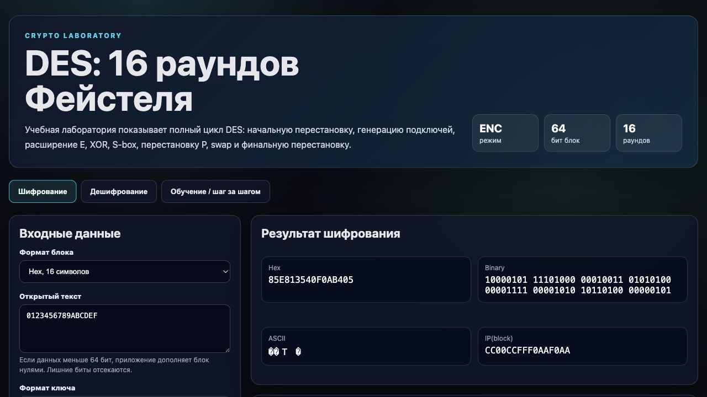

# Домашнее задание: теория информации и протоколы безопасного обмена данными

Комплект содержит три задания и материалы для демонстрации:

- Задание 1: эссе об электронной цифровой подписи.
- Задание 2: интерактивное приложение для кодирования Хаффмана.
- Задание 3: интерактивная DES crypto-lab с шифрованием, дешифрованием и пошаговой визуализацией.

Все страницы открываются напрямую в браузере. Для публикации подойдут GitHub Pages, Vercel, Netlify или GitHub Gist. Сборка и сервер не требуются; внешний CDN используется только для Tailwind CSS и reveal.js.

## Структура

```text
theory-of-info-hw/
├── assets/
│   ├── des-screenshot.png
│   └── huffman-screenshot.png
├── task1-eds-essay/
│   └── essay.html
├── task2-huffman/
│   ├── huffman.html
│   └── demo-script.md
├── task3-des/
│   ├── index.html
│   ├── des.js
│   ├── ui.js
│   ├── styles.css
│   ├── presentation.html
│   └── demo-script.md
└── README.md
```

## Запуск локально

Можно просто открыть HTML-файлы двойным кликом:

- `task1-eds-essay/essay.html`
- `task2-huffman/huffman.html`
- `task3-des/index.html`
- `task3-des/presentation.html`

Для DES лучше открыть папку через небольшой локальный сервер, потому что `index.html` использует ES-модули:

```bash
cd theory-of-info-hw
python3 -m http.server 8765
```

Затем открыть:

- `http://127.0.0.1:8765/task2-huffman/huffman.html`
- `http://127.0.0.1:8765/task3-des/index.html`
- `http://127.0.0.1:8765/task3-des/presentation.html`

## Скриншоты

### Хаффман



### DES



## Что реализовано

### Задание 1: ЭЦП

Файл: `task1-eds-essay/essay.html`

- определение ЭЦП своими словами;
- математическая суть: хэш, закрытый ключ, открытый ключ, проверка;
- актуальность для Госуслуг, ФНС, ЭДО, удалённой работы и кибербезопасности;
- применение в госинфраструктуре, закупках, криптовалютах, TLS, code signing и финтехе;
- правовой, технический и криптографический аспекты: 63-ФЗ, PKI, RSA, ECDSA, ГОСТ Р 34.10-2012;
- риски: компрометация ключа и переход к постквантовой криптографии;
- мини-сценарий удалённого подписания договора.

### Задание 2: Хаффман

Файл: `task2-huffman/huffman.html`

- ввод символов и вероятностей;
- удаление, очистка, три пресета;
- валидация суммы вероятностей `1.0 ± 0.001`;
- классический алгоритм объединения двух минимальных узлов;
- генерация префиксных кодов;
- SVG-визуализация дерева и пошаговая анимация;
- таблица кодов;
- расчёт `L`, `H`, `η = L / H`;
- сравнение с равномерным кодом;
- кодирование и декодирование пользовательского текста;
- экспорт результатов в JSON и CSV.

Демо-скрипт: `task2-huffman/demo-script.md`

### Задание 3: DES

Файл: `task3-des/index.html`

- ввод 64-битного блока и ключа в hex, binary или ASCII;
- полный DES: IP, 16 раундов, E, XOR, S-box, P, swap, FP;
- генерация 16 подключей через PC-1, циклические сдвиги и PC-2;
- шифрование и дешифрование обратным порядком подключей;
- пошаговый просмотр раундов;
- подсветка изменяющихся битов;
- таблицы S-box с активной ячейкой;
- просмотр всех подключей;
- проверка нечётной чётности байтов ключа;
- предупреждения о слабых ключах;
- оценка brute force для пространства `2^56`.

Контрольный тест-вектор:

```text
Plaintext:  0123456789ABCDEF
Key:        133457799BBCDFF1
Ciphertext: 85E813540F0AB405
```

Презентация: `task3-des/presentation.html`  
Демо-скрипт: `task3-des/demo-script.md`

## Публикация на GitHub Pages за 5 минут

1. Создать репозиторий на GitHub, например `theory-of-info-hw`.
2. Загрузить содержимое папки `theory-of-info-hw` в корень репозитория.
3. Открыть `Settings → Pages`.
4. В разделе `Build and deployment` выбрать `Deploy from a branch`.
5. Указать ветку `main` и папку `/root`, затем нажать `Save`.
6. Через 1-2 минуты GitHub Pages выдаст адрес вида `https://username.github.io/theory-of-info-hw/`.

После публикации ссылки будут такими:

- Эссе: `https://username.github.io/theory-of-info-hw/task1-eds-essay/essay.html`
- Хаффман: `https://username.github.io/theory-of-info-hw/task2-huffman/huffman.html`
- DES: `https://username.github.io/theory-of-info-hw/task3-des/index.html`
- Презентация DES: `https://username.github.io/theory-of-info-hw/task3-des/presentation.html`

## Шаблон письма преподавателю

```text
Тема: [ТиПБОД] Домашнее задание — [ФИО]

Уважаемый преподаватель!

Направляю ссылки на результаты выполнения домашнего задания:

Задание 1 (Эссе об ЭЦП): [ссылка]
Задание 2 (Кодирование Хаффмана): [ссылка на приложение] + [ссылка на демо-видео]
Задание 3 (Протокол DES): [ссылка на приложение] + [ссылка на презентацию] + [ссылка на демо-видео]

Исходный код: [ссылка на GitHub]

С уважением, [ФИО]
```

## Контроль качества

- [x] Эссе: объём 2-3 страницы, понятное изложение, реальные примеры, ГОСТ и PKI.
- [x] Хаффман: корректный алгоритм, визуализация дерева, валидация вероятностей, расчёт `L` и `H`.
- [x] DES: 16 раундов, S-box, IP/FP, обратимость на стандартном тест-векторе.
- [x] UI: адаптивный дизайн, тёмная тема для DES, минималистичная визуальная подача.
- [x] Код: комментарии на русском, без ошибок в консоли при браузерной проверке.
- [x] Демо-скрипты: готовы к озвучке или субтитрам.
